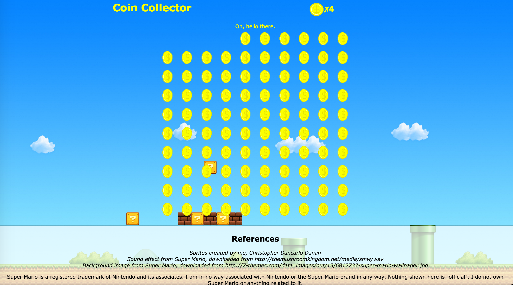

# Coin-Collector
A fun little collecting game for those who are obsessive compulsive.

What is it?
-----------------
This is just a simple game where the player collects a never-ending supply of golden coins with his/her mouse.
The game has no end; players can simply collect until they tire of collecting!

The coins reappear within a few seconds after being collected. If the player collects all the coins in the grid before
time runs out, something special may appear.

I developed this for fun when the idea popped into my brain.
It is playable on my website here: http://poisongrapes.com/CoinCollector/index.html

Notes
-----------------
This project is developed for web browsers only. I know there's a big push for mobile friendly projects, but this
is something I coded for the fun of it without thinking too much about the mobile market. I developed using the Chrome
browser, so I recommend playing the game on that.

Unfortunately, there is a known lag issue when playing with the Safari browser. Currently, I do not know of a way to
solve that.

Finally, I want to emphasize that I *do not* own the Super Mario brand in any way. I am not affiliated with Nintendo
or any of their associates.
